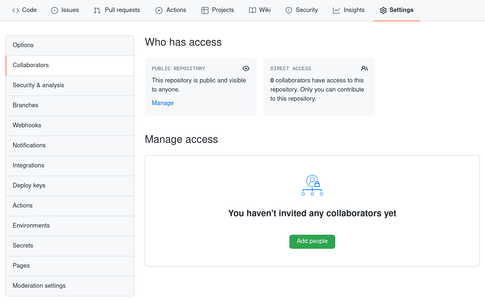
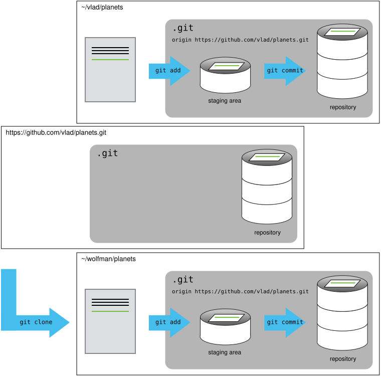

::::::::::::::::::::::::::::::::::::::: objectives

- リモートリポジトリをクローンする。
- 共通リポジトリにプッシュしてコラボレーションする。
- 基本的な共同作業のワークフローを説明する。

::::::::::::::::::::::::::::::::::::::::::::::::::

:::::::::::::::::::::::::::::::::::::::: questions

- バージョン管理をどのように使って他の人と共同作業できますか？

::::::::::::::::::::::::::::::::::::::::::::::::::

次のステップでは、ペアになって進めてください。一人は「オーナー」、もう一人は「コラボレーター」となります。
目的は、コラボレーターがオーナーのリポジトリに変更を加えることです。最後に役割を交代するので、両方がオーナーとコラボレーターの両方を体験します。

:::::::::::::::::::::::::::::::::::::::::  callout

## 一人で練習する場合

このレッスンを一人で進めている場合は、2つ目のターミナルウィンドウを開くことで続行できます。
この新しいウィンドウが、別のコンピュータで作業しているパートナーを表します。
GitHubで誰かにアクセスを許可する必要はありません。なぜなら、両方の「パートナー」は自分だからです。

::::::::::::::::::::::::::::::::::::::::::::::::::

オーナーはコラボレーターにアクセス権を与える必要があります。GitHubのリポジトリページで、「Settings」ボタンをクリックし、「Collaborators」を選択し、「Add people」をクリックして、パートナーのユーザー名を入力します。

{alt='GitHubのCollaborators設定ページのスクリーンショット。「Settings」をクリックし、「Collaborators」を選択してアクセスします'}

コラボレーターは、オーナーのリポジトリへのアクセスを受け入れる必要があります。[https://github.com/notifications](https://github.com/notifications) にアクセスするか、メール通知を確認します。そこでオーナーのリポジトリへのアクセスを承認できます。

次に、コラボレーターはオーナーのリポジトリのコピーを自分のマシンにダウンロードします。これを「リポジトリをクローンする」と呼びます。

コラボレーターは自分の `planets.git` バージョンを上書きしたくないため、同じ名前のリポジトリを持つ自分のリポジトリとは異なる場所にオーナーのリポジトリをクローンする必要があります。

コラボレーターがオーナーのリポジトリを自分の `Desktop` フォルダにクローンするには、次のコマンドを入力します：

```bash
$ git clone git@github.com:vlad/planets.git ~/Desktop/vlad-planets
```

'vlad' をオーナーのユーザー名に置き換えてください。

クローンパス（`~/Desktop/vlad-planets`）を指定せずにクローンを実行すると、自分の `planets` フォルダ内にクローンされてしまいます！ 必ず最初に `Desktop` フォルダに移動してください。

{alt='「git clone」を使用してリモートGitHubリポジトリのコピーを作成し、別の人がローカルリポジトリを作成して変更を加えられるようにする方法を示す図'}

コラボレーターは、オーナーのリポジトリのクローン内で、これまでと同じ方法で変更を加えることができます：

```bash
$ cd ~/Desktop/vlad-planets
$ nano pluto.txt
$ cat pluto.txt
```

```output
It is so a planet!
```

```bash
$ git add pluto.txt
$ git commit -m "Add notes about Pluto"
```

```output
 1 file changed, 1 insertion(+)
 create mode 100644 pluto.txt
```

その後、変更をGitHub上の_オーナーのリポジトリ_にプッシュします：

```bash
$ git push origin main
```

```output
Enumerating objects: 4, done.
Counting objects: 4, done.
Delta compression using up to 4 threads.
Compressing objects: 100% (2/2), done.
Writing objects: 100% (3/3), 306 bytes, done.
Total 3 (delta 0), reused 0 (delta 0)
To https://github.com/vlad/planets.git
   9272da5..29aba7c  main -> main
```

リモートを `origin` と呼ぶ必要がなかったことに注目してください：Gitはリポジトリをクローンしたときにデフォルトでこの名前を使用します。
（これは、以前リモートを手動で設定した際に `origin` を使用したのが妥当であった理由です。）

もう一度オーナーのリポジトリをGitHubで確認すると、コラボレーターによって作成された新しいコミットが表示されるはずです。ブラウザを更新して新しいコミットを確認してください。

:::::::::::::::::::::::::::::::::::::::::  callout

## リモートについてさらに詳しく

このエピソードと前のエピソードでは、ローカルリポジトリには `origin` と呼ばれる単一の「リモート」が設定されていました。
リモートは、どこか別の場所にホストされているリポジトリのコピーであり、プッシュやプルを行うことができます。また、1つだけで作業する必要はありません。
たとえば、大規模なプロジェクトでは、自分のGitHubアカウントにあるコピー（おそらく `origin` と呼ぶ）と、メインの「上流」プロジェクトリポジトリ（例として `upstream` と呼ぶ）を持つことがあります。
他の人がコミットした最新の更新を取得するために、時々 `upstream` からプルします。

リモートに付ける名前はローカルでのみ存在します。それはエイリアスであり、`origin`、`upstream`、`fred` など、選んだ名前です。
リモートリポジトリ自体には固有の名前はありません。

`git remote` ファミリーのコマンドを使用して、リモートの設定や変更を行います。以下は最も役立つコマンドです：

- `git remote -v`: 設定されているすべてのリモートを一覧表示します（前のエピソードで使用しました）。
- `git remote add [name] [url]`: 新しいリモートを追加します。
- `git remote remove [name]`: リモートを削除します。これはリモートリポジトリ自体には影響せず、ローカルリポジトリからリンクを削除するだけです。
- `git remote set-url [name] [newurl]`: リモートに関連付けられているURLを変更します。たとえば、別のGitHubアカウントやホスティングサービスに移動した場合、またはURLを追加時にタイプミスをした場合に使用します。
- `git remote rename [oldname] [newname]`: リモートのローカルエイリアス（名前）を変更します。たとえば、`upstream` を `fred` に変更できます。

::::::::::::::::::::::::::::::::::::::::::::::::::

コラボレーターの変更をGitHubからダウンロードするために、オーナーは次のコマンドを入力します：

```bash
$ git pull origin main
```

```output
remote: Enumerating objects: 4, done.
remote: Counting objects: 100% (4/4), done.
remote: Compressing objects: 100% (2/2), done.
remote: Total 3 (delta 0), reused 3 (delta 0), pack-reused 0
Unpacking objects: 100% (3/3), done.
From https://github.com/vlad/planets
 * branch            main     -> FETCH_HEAD
   9272da5..29aba7c  main     -> origin/main
Updating 9272da5..29aba7c
Fast-forward
 pluto.txt | 1 +
 1 file changed, 1 insertion(+)
 create mode 100644 pluto.txt
```

これで3つのリポジトリ（オーナーのローカル、コラボレーターのローカル、オーナーのGitHub上のリポジトリ）が再び同期されました。

:::::::::::::::::::::::::::::::::::::::::  callout

## 基本的な共同作業のワークフ

ロー

実際には、共同作業を行っているリポジトリの最新バージョンを取得していることを確認するのが良い習慣です。そのため、変更を加える前に `git pull` を実行してください。基本的な共同作業のワークフローは次のようになります：

- `git pull origin main` を使用してローカルリポジトリを更新する。
- 変更を加え、それらを `git add` でステージする。
- `git commit -m` を使用して変更をコミットする。
- `git push origin main` を使用して変更をGitHubにアップロードする。

1回の大規模な変更を含むコミットよりも、小さな変更を含む多くのコミットを行う方が望ましいです。小さなコミットの方が読みやすく、レビューしやすいからです。

::::::::::::::::::::::::::::::::::::::::::::::::::

:::::::::::::::::::::::::::::::::::::::  challenge

## 役割を交代して再実行

役割を交代し、全プロセスを繰り返してください。

::::::::::::::::::::::::::::::::::::::::::::::::::

:::::::::::::::::::::::::::::::::::::::  challenge

## 変更をレビューする

オーナーがコラボレーターに情報を与えずにリポジトリにコミットをプッシュしました。
コマンドラインでは、コラボレーターはどのようにして変更を確認できますか？
また、GitHubではどうでしょうか？

:::::::::::::::  solution

## 解答

コマンドラインでは、コラボレーターは `git fetch origin main` を使用してリモートの変更をローカルリポジトリに取得できます。ただし、マージは行われません。
その後、`git diff main origin/main` を実行することで、変更をターミナルに表示できます。

GitHubでは、コラボレーターがリポジトリにアクセスして「commits」をクリックすると、リポジトリにプッシュされた最新のコミットを見ることができます。

:::::::::::::::::::::::::

::::::::::::::::::::::::::::::::::::::::::::::::::

:::::::::::::::::::::::::::::::::::::::  challenge

## GitHubで変更にコメントする

コラボレーターがオーナーによる1行の変更について質問があり、提案をしたいとします。

GitHubでは、コミットの差分にコメントを追加することが可能です。コメントを付けたいコード行の上に青いコメントアイコンが表示され、コメントウィンドウを開くことができます。

コラボレーターはGitHubインターフェースを使用してコメントと提案を投稿します。

::::::::::::::::::::::::::::::::::::::::::::::::::

:::::::::::::::::::::::::::::::::::::::  challenge

## バージョン履歴、バックアップ、バージョン管理

一部のバックアップソフトウェアは、ファイルのバージョン履歴を保持し、特定のバージョンを復元することができます。この機能はバージョン管理とはどのように異なりますか？また、バージョン管理（GitやGitHub）の利点は何ですか？

::::::::::::::::::::::::::::::::::::::::::::::::::

:::::::::::::::::::::::::::::::::::::::: keypoints

- `git clone` はリモートリポジトリをコピーして、リモートが自動的に `origin` として設定されたローカルリポジトリを作成します。

::::::::::::::::::::::::::::::::::::::::::::::::::
