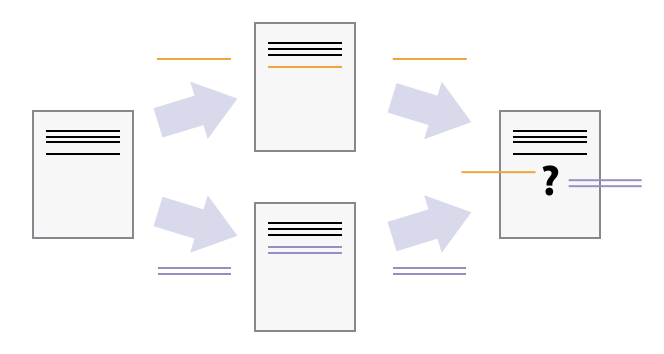

::::::::::::::::::::::::::::::::::::::: objectives

- コンフリクトとは何か、いつ発生するのかを説明する。
- マージによるコンフリクトを解消する。

::::::::::::::::::::::::::::::::::::::::::::::::::

:::::::::::::::::::::::::::::::::::::::: questions

- 自分の変更が他の人の変更と競合した場合、どうすればいいですか？

::::::::::::::::::::::::::::::::::::::::::::::::::

複数の人が並行して作業できるようになると、互いの作業が衝突する可能性が高まります。
これは一人で作業している場合でも起こり得ます。
例えば、ラップトップと研究室のサーバーで同じソフトウェアを作業している場合、それぞれのコピーに異なる変更を加える可能性があります。
バージョン管理は、[コンフリクト](../learners/reference.md#conflict)を管理し、
重複する変更を[解決](../learners/reference.md#resolve)するためのツールを提供します。

### コンフリクトを作成してみる

まずコンフリクトを解決する方法を学ぶために、実際にコンフリクトを作成します。
現在、`planets` リポジトリの `mars.txt` ファイルは、オーナーとコラボレーターの両方のコピーで次のようになっています：

```bash
$ cat mars.txt
```

```output
Cold and dry, but everything is my favorite color
The two moons may be a problem for Wolfman
But the Mummy will appreciate the lack of humidity
```

#### コラボレーターによる変更

コラボレーターが自分のコピーに次の行を追加します：

```bash
$ nano mars.txt
$ cat mars.txt
```

```output
Cold and dry, but everything is my favorite color
The two moons may be a problem for Wolfman
But the Mummy will appreciate the lack of humidity
This line added to Wolfman's copy
```

変更をGitHubにプッシュします：

```bash
$ git add mars.txt
$ git commit -m "Add a line in our home copy"
```

```output
[main 5ae9631] Add a line in our home copy
 1 file changed, 1 insertion(+)
```

```bash
$ git push origin main
```

```output
Enumerating objects: 5, done.
Counting objects: 100% (5/5), done.
Delta compression using up to 8 threads
Compressing objects: 100% (3/3), done.
Writing objects: 100% (3/3), 331 bytes | 331.00 KiB/s, done.
Total 3 (delta 2), reused 0 (delta 0)
remote: Resolving deltas: 100% (2/2), completed with 2 local objects.
To https://github.com/vlad/planets.git
   29aba7c..dabb4c8  main -> main
```

#### オーナーによる別の変更

次に、オーナーがGitHubから更新せずに異なる変更を加えます：

```bash
$ nano mars.txt
$ cat mars.txt
```

```output
Cold and dry, but everything is my favorite color
The two moons may be a problem for Wolfman
But the Mummy will appreciate the lack of humidity
We added a different line in the other copy
```

ローカルでコミットします：

```bash
$ git add mars.txt
$ git commit -m "Add a line in my copy"
```

```output
[main 07ebc69] Add a line in my copy
 1 file changed, 1 insertion(+)
```

GitHubへのプッシュを試みるとエラーが発生します：

```bash
$ git push origin main
```

```output
To https://github.com/vlad/planets.git
 ! [rejected]        main -> main (fetch first)
error: failed to push some refs to 'https://github.com/vlad/planets.git'
hint: Updates were rejected because the remote contains work that you do
hint: not have locally. This is usually caused by another repository pushing
hint: to the same ref. You may want to first integrate the remote changes
hint: (e.g., 'git pull ...') before pushing again.
hint: See the 'Note about fast-forwards' in 'git push --help' for details.
```

{alt='2つの独立した変更がマージされる際に発生する可能性があるコンフリクトを示す図'}

Gitは、リモートリポジトリに新しい更新があり、それがローカルブランチに取り込まれていないことを検出したため、プッシュを拒否します。
この問題を解決するには、GitHubから変更をプルして現在作業しているコピーにマージし、それをプッシュする必要があります。

#### GitHubから変更をプルする

```bash
$ git pull origin main
```

```output
remote: Enumerating objects: 5, done.
remote: Counting objects: 100% (5/5), done.
remote: Compressing objects: 100% (1/1), done.
remote: Total 3 (delta 2), reused 3 (delta 2), pack-reused 0
Unpacking objects: 100% (3/3), done.
From https://github.com/vlad/planets
 * branch            main     -> FETCH_HEAD
    29aba7c..dabb4c8  main     -> origin/main
Auto-merging mars.txt
CONFLICT (content): Merge conflict in mars.txt
Automatic merge failed; fix conflicts and then commit the result.
```

`git pull` コマンドはローカルリポジトリを更新し、リモートリポジトリの変更を含むようにします。
リモートブランチからの変更がフェッチされた後、Gitはローカルコピーに加えられた変更がリモートリポジトリの変更と重なっていることを検出し、2つのバージョンをマージしません。

#### コンフリクトの内容を確認する

```bash
$ cat mars.txt
```

```output
Cold and dry, but everything is my favorite color
The two moons may be a problem for Wolfman
But the Mummy will appreciate the lack of humidity
<<<<<<< HEAD
We added a different line in the other copy
=======
This line added to Wolfman's copy
>>>>>>> dabb4c8c450e8475aee9b14b4383acc99f42af1d
```

コンフリクトが発生した箇所がマーカーで示されています。  
`<<<<<<< HEAD` はローカルの変更を示し、`=======` は変更の区切りを示します。
`>>>>>>>` の後の文字列は、GitHubからダウンロードしたコミットを特定するための識別子です。

#### コンフリクトの解消

ファイルを編集してコンフリクトマーカーを削除し、両方の変更を調整します。
ここでは両方の変更を置き換えて次のようにします：

```bash
$ cat mars.txt
```

```output
Cold and dry, but everything is my favorite color
The two moons may be a problem for Wolfman
But the Mummy will appreciate the lack of humidity
We removed the conflict on this line
```

#### マージを完了する

```bash
$ git add mars.txt
$ git status
```

```output
On branch main
All conflicts fixed but you are still merging.
  (use "git commit" to conclude merge)

Changes to be committed:

	modified:   mars.txt
```

```bash
$ git commit -m "Merge changes from GitHub"
```

```output
[main 2abf2b1] Merge changes from GitHub
```

#### 最終的に変更をプッシュする

```bash
$ git push origin main
```

```output
Enumerating objects: 10, done.
Counting objects: 100% (10/10), done.
Delta compression using up to 8 threads
Compressing objects: 100% (6/6), done.
Writing objects: 100% (6/6), 645 bytes | 645.00 KiB/s, done.
Total 6 (delta 4), reused 0 (delta 0)
remote: Resolving deltas: 100% (4/4), completed with 2 local objects.
To https://github.com/vlad/planets.git
   dabb4c8..2abf2b1  main -> main
```

Gitは、何をどのようにマージしたかを記録しているため、最初に変更を加えたコラボレーターが再度プルする際には、手作業で修正する必要がありません：

```bash
$ git pull origin main
```

```output
remote: Enumerating objects: 10, done.
remote: Counting objects: 100% (10/10), done.
remote: Compress

ing objects: 100% (2/2), done.
remote: Total 6 (delta 4), reused 6 (delta 4), pack-reused 0
Unpacking objects: 100% (6/6), done.
From https://github.com/vlad/planets
 * branch            main     -> FETCH_HEAD
    dabb4c8..2abf2b1  main     -> origin/main
Updating dabb4c8..2abf2b1
Fast-forward
 mars.txt | 2 +-
 1 file changed, 1 insertion(+), 1 deletion(-)
```

#### 結果の確認

```bash
$ cat mars.txt
```

```output
Cold and dry, but everything is my favorite color
The two moons may be a problem for Wolfman
But the Mummy will appreciate the lack of humidity
We removed the conflict on this line
```

Gitは、誰かが既にマージを行ったことを認識しているため、再度マージする必要はありません。

Gitのコンフリクト解決機能は非常に便利ですが、コンフリクト解決には時間と労力がかかり、適切に解決されないとエラーが生じる可能性があります。プロジェクトで頻繁にコンフリクトを解決している場合、次のような技術的なアプローチを検討してください：

- 上流から頻繁にプルする、特に新しい作業を始める前に。
- トピックブランチを使用して作業を分離し、完了後にメインブランチにマージする。
- より小さく、より原子的なコミットを作成する。
- 作業が完了したらプッシュし、チームにも同じことを促すことで作業中の変更を減らし、結果としてコンフリクトの可能性を減らす。
- 論理的に適切であれば、大きなファイルをより小さなファイルに分割して、同じファイルを同時に変更する可能性を減らす。

プロジェクト管理の戦略でもコンフリクトを最小限に抑えることができます：

- 責任分担を明確にする。
- コラボレーターとタスクの順序を話し合い、同じ行に影響を与える可能性のあるタスクが同時に作業されないようにする。
- スタイルの変更によるコンフリクト（例：タブとスペースの違いなど）の場合、プロジェクトの規約を定め、必要に応じてコードスタイルツール（例：`htmltidy`、`perltidy`、`rubocop` など）を使用して規約を強制する。

:::::::::::::::::::::::::::::::::::::::  challenge

## 自分でコンフリクトを解決する

インストラクターが作成したリポジトリをクローンしてください。
新しいファイルを追加し、既存のファイル（インストラクターが指定するもの）を変更します。
指示があったら、リポジトリからインストラクターの変更をプルしてコンフリクトを作成し、それを解決してください。

::::::::::::::::::::::::::::::::::::::::::::::::::

:::::::::::::::::::::::::::::::::::::::  challenge

## 非テキストファイルのコンフリクト

画像やその他の非テキストファイルがバージョン管理に保存されている場合、コンフリクトが発生するとGitはどうしますか？

:::::::::::::::  solution

## 解答

試してみましょう。ドラキュラが火星の表面を撮影し、その画像を `mars.jpg` と名付けたとします。

火星の画像ファイルが手元にない場合は、次のようにダミーのバイナリファイルを作成できます：

```bash
$ head -c 1024 /dev/urandom > mars.jpg
$ ls -lh mars.jpg
```

```output
-rw-r--r-- 1 vlad 57095 1.0K Mar  8 20:24 mars.jpg
```

`ls` コマンドは、ランダムなバイトが `/dev/urandom` から読み取られた1キロバイトのファイルが作成されたことを示します。

次に、ドラキュラが `mars.jpg` をリポジトリに追加したとします：

```bash
$ git add mars.jpg
$ git commit -m "Add picture of Martian surface"
```

```output
[main 8e4115c] Add picture of Martian surface
 1 file changed, 0 insertions(+), 0 deletions(-)
 create mode 100644 mars.jpg
```

一方、ウルフマンが火星の空の写真を追加しましたが、こちらもファイル名が `mars.jpg` です。
ドラキュラがプッシュを試みると、次のようなエラーが発生します：

```bash
$ git push origin main
```

```output
To https://github.com/vlad/planets.git
 ! [rejected]        main -> main (fetch first)
error: failed to push some refs to 'https://github.com/vlad/planets.git'
hint: Updates were rejected because the remote contains work that you do
hint: not have locally. This is usually caused by another repository pushing
hint: to the same ref. You may want to first integrate the remote changes
hint: (e.g., 'git pull ...') before pushing again.
hint: See the 'Note about fast-forwards' in 'git push --help' for details.
```

最初にプルしてコンフリクトを解決する必要があります：

```bash
$ git pull origin main
```

画像やその他のバイナリファイルでコンフリクトが発生すると、Gitは次のようなメッセージを表示します：

```output
$ git pull origin main
remote: Counting objects: 3, done.
remote: Compressing objects: 100% (3/3), done.
remote: Total 3 (delta 0), reused 0 (delta 0)
Unpacking objects: 100% (3/3), done.
From https://github.com/vlad/planets
 * branch            main     -> FETCH_HEAD
   6a67967..439dc8c  main     -> origin/main
warning: Cannot merge binary files: mars.jpg (HEAD vs. 439dc8c08869c342438f6dc4a2b615b05b93c76e)
Auto-merging mars.jpg
CONFLICT (add/add): Merge conflict in mars.jpg
Automatic merge failed; fix conflicts and then commit the result.
```

バイナリファイルの場合、Gitはテキストファイルのようにコンフリクトマーカーを挿入することができません。
代わりに、保持したいバージョンを選択してチェックアウトし、それを追加してコミットします。

Gitは便利なことに、2つのバージョンの `mars.jpg` のコミット識別子を提供します。
自分のバージョンは `HEAD`、ウルフマンのバージョンは `439dc8c0` です。
自分のバージョンを使用したい場合、次のようにします：

```bash
$ git checkout HEAD mars.jpg
$ git add mars.jpg
$ git commit -m "Use image of surface instead of sky"
```

```output
[main 21032c3] Use image of surface instead of sky
```

ウルフマンのバージョンを使用したい場合、次のようにします：

```bash
$ git checkout 439dc8c0 mars.jpg
$ git add mars.jpg
$ git commit -m "Use image of sky instead of surface"
```

```output
[main da21b34] Use image of sky instead of surface
```

両方の画像を保持したい場合、名前が重複しないようにそれぞれのバージョンをチェックアウトしてリネームします：

```bash
$ git checkout HEAD mars.jpg
$ git mv mars.jpg mars-surface.jpg
$ git checkout 439dc8c0 mars.jpg
$ mv mars.jpg mars-sky.jpg
```

次に、古い `mars.jpg` を削除し、新しいファイルを追加します：

```bash
$ git rm mars.jpg
$ git add mars-surface.jpg
$ git add mars-sky.jpg
$ git commit -m "Use two images: surface and sky"
```

```output
[main 94ae08c] Use two images: surface and sky
 2 files changed, 0 insertions(+), 0 deletions(-)
 create mode 100644 mars-sky.jpg
 rename mars.jpg => mars-surface.jpg (100%)
```

これで、両方の画像がリポジトリにチェックインされ、`mars.jpg` は存在しなくなります。

:::::::::::::::::::::::::

::::::::::::::::::::::::::::::::::::::::::::::::::

:::::::::::::::::::::::::::::::::::::::  challenge

## 典型的な作業セッション

リモートGitリポジトリで管理されている共有プロジェクトに取り組むためにコンピュータに向かいます。作業セッション中に以下のアクションを実行しますが、順序は異なります：

- テキストファイル `numbers.txt` に数値 `100` を追記する。
- リモートリポジトリをローカルリポジトリに一致させる。
- 成功を祝う。
- ローカルリポジトリをリモートリポジトリに一致させる。
- 変更をステージングする。
- ローカルリポジトリに変更をコミットする。

コンフリクトの可能性を最小限に抑えるために、どの順序でこれらのアクションを実行すべきですか？

表の「アクション」列に順序を記入し、「コマンド」列に対応するコマンドを記述してください。

| order | action                      | command                          |
|-------|-----------------------------|-----------------------------------|
| 1     |                             | `git pull origin main`           |
| 2     | Make changes                | `echo 100 >> numbers.txt`        |
| 3     | Stage changes               | `git add numbers.txt`            |
| 4     | Commit changes              | `git commit -m "Add 100 to numbers.txt"` |
| 5     | Update remote               | `git push origin main`           |
| 6     | Celebrate!                  |                                   |

::::::::::::::::::::::::::::::::::::::::::::::::::

:::::::::::::::::::::::::::::::::::::::: keypoints

- コンフリクトは、2人以上が同じファイルの同じ行を変更したときに発生します。
- バージョン管理システムは、変更を無視して上書きすることを許さず、コンフリクトを強調表示して解決を促します。

::::::::::::::::::::::::::::::::::::::::::::::::::
