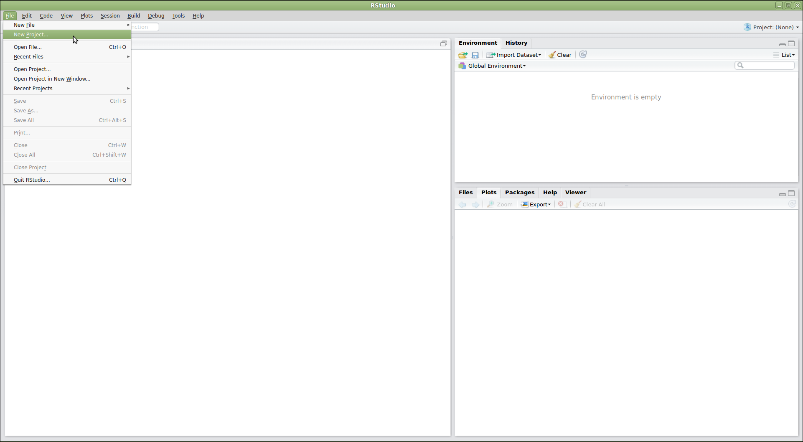
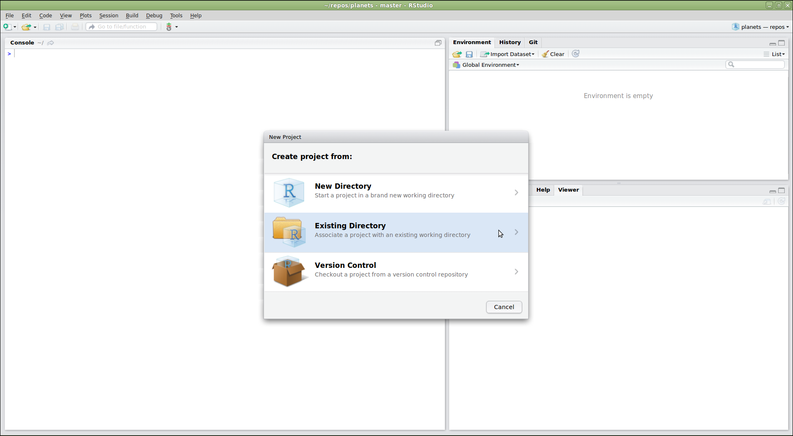
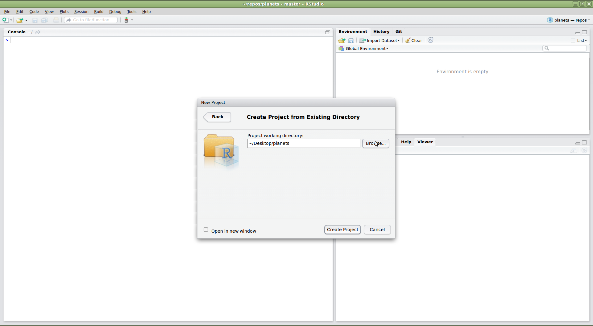
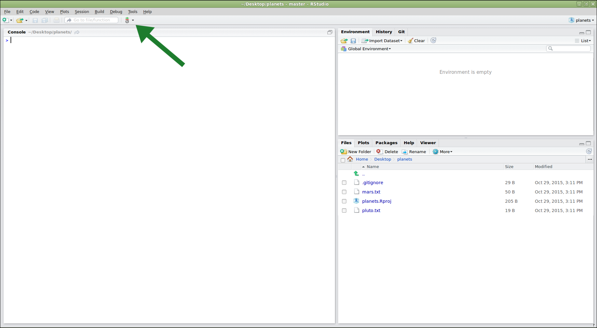
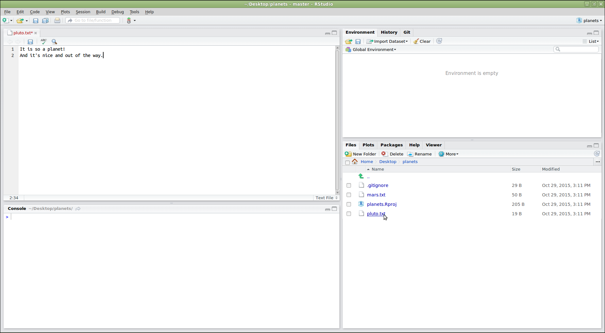
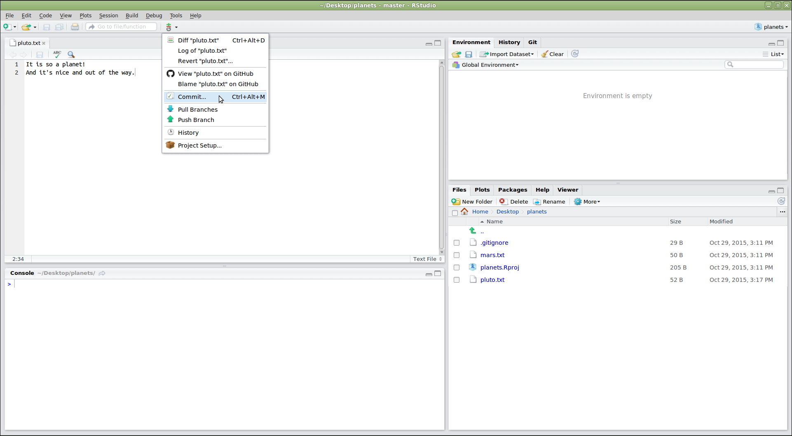
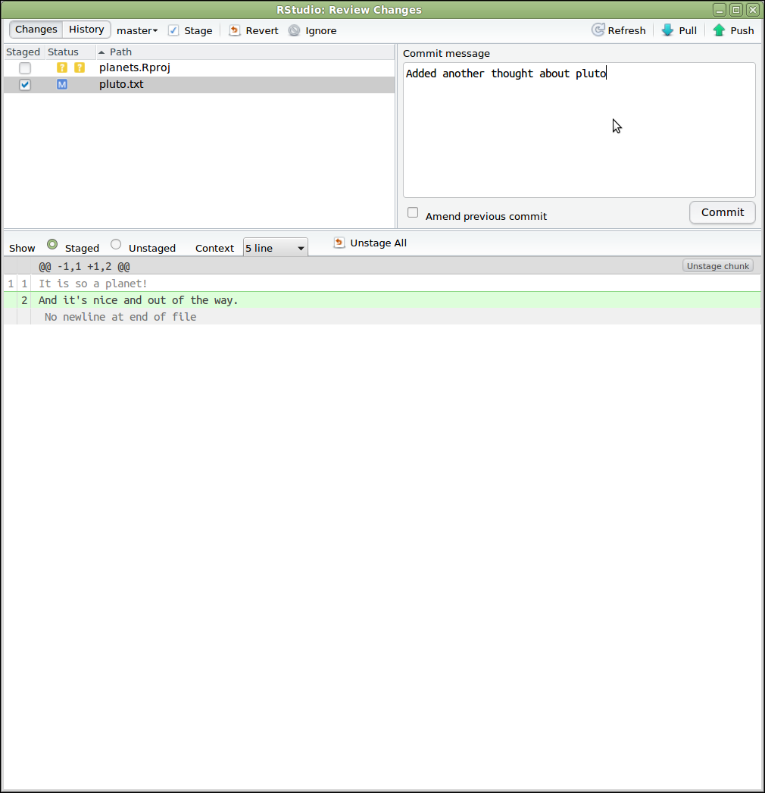
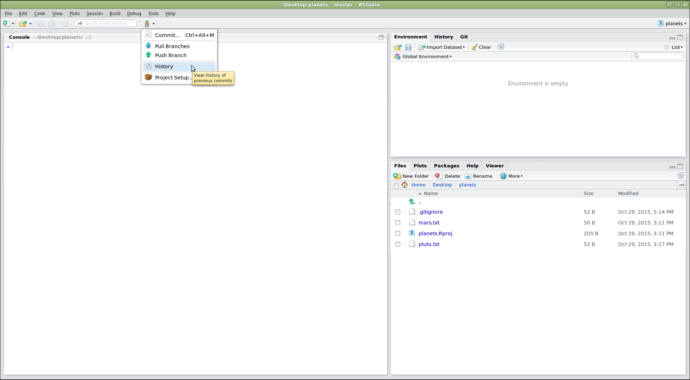
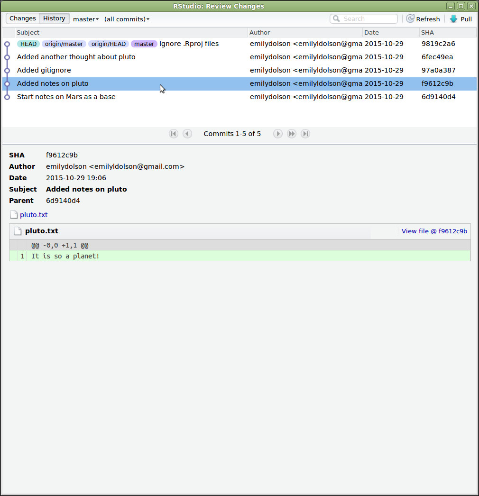
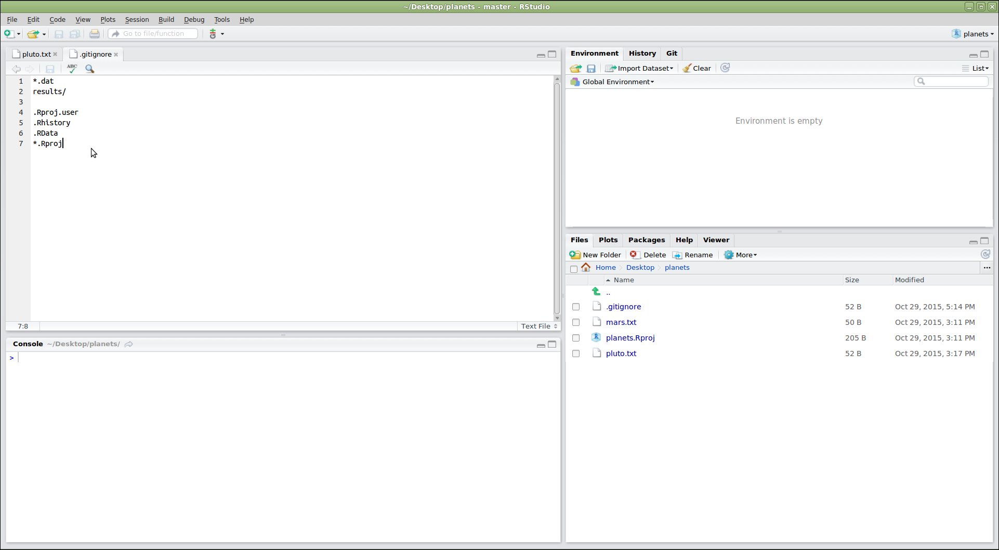

::::::::::::::::::::::::::::::::::::::: objectives

- RStudio を使用して Git を利用する方法を理解する。

::::::::::::::::::::::::::::::::::::::::::::::::::

:::::::::::::::::::::::::::::::::::::::: questions

- RStudio で Git をどのように使うことができますか？

::::::::::::::::::::::::::::::::::::::::::::::::::

データ分析スクリプトを開発する際にバージョン管理は非常に便利です。そのため、R プログラミング言語用の人気開発環境である [RStudio][rstudio] には、Git と統合された機能が組み込まれています。  
一部の高度な Git 機能はコマンドラインを必要としますが、RStudio は多くの一般的な Git 操作に便利なインターフェイスを提供します。

RStudio では、特定のディレクトリに関連するさまざまなファイルを管理するために [プロジェクト][rstudio-projects] を作成できます。プロジェクトの進行状況を追跡し、以前のバージョンに戻したり、他の人とコラボレーションしたりするために、RStudio プロジェクトを Git でバージョン管理します。RStudio で Git を使用するには、新しいプロジェクトを作成します：

{alt='RStudio のスクリーンショット。「New Project...」が選択されたファイルメニュードロップダウンを表示'}

この操作により、プロジェクトをどのように作成するかを尋ねるダイアログが開きます。いくつかのオプションがあります。ここでは、既に作成した `planets` リポジトリを RStudio で使用したいとします。そのリポジトリがコンピュータ上のディレクトリに存在するため、「Existing Directory」オプションを選択します：

{alt='RStudio のスクリーンショット。「Create project from existing directory」が選択された New Project ダイアログウィンドウ'}

:::::::::::::::::::::::::::::::::::::::::  callout

## 「Version Control」オプションが表示されていますか？

ここでは使用しませんが、このメニューには「Version Control」オプションが表示されるはずです。このオプションは、GitHub からリポジトリをクローンしてプロジェクトを作成する場合にクリックします。  
このオプションが表示されない場合、RStudio が Git 実行可能ファイルの場所を認識していない可能性があります。このレッスンを進めるには、RStudio に Git の場所を教える必要があります。

### Git 実行可能ファイルを見つける

まず、Git がコンピュータにインストールされていることを確認します。macOS または Linux の場合はシェルを開き、Windows の場合はコマンドプロンプトを開いて次を入力します：

- `which git`（macOS, Linux）
- `where git`（Windows）

コンピュータに Git がインストールされていない場合は、[Git のインストール手順](https://swcarpentry.github.io/git-novice/#installing-git) を参考にインストールしてください。その後、再度 `which git`（macOS, Linux）、または `where git`（Windows）を入力して、Git 実行可能ファイルのパスをコピーします。

例：Windows で GitHub Desktop がインストールされている場合、パスは次のようになります：  
`C:/Users/UserName/AppData/Local/GitHubDesktop/app-1.1.1/resources/app/git/cmd/git.exe`

### RStudio に Git の場所を指定する

RStudio のメニューから `Tools` > `Global Options` > `Git/SVN` に進み、見つけた Git 実行可能ファイルを参照して設定します。その後、RStudio を再起動してください。  
注意：macOS を使用している場合は、Git がインストールされていても Xcode のライセンスを承認する必要がある場合があります。

::::::::::::::::::::::::::::::::::::::::::::::::::

次に、RStudio は使用する既存のディレクトリを尋ねます。「Browse...」をクリックして該当するディレクトリに移動し、「Create Project」をクリックします：

{alt='「Create Project From Existing Directory」ダイアログを表示した RStudio ウィンドウ。ダイアログでは、プロジェクトの作業ディレクトリが "~/Desktop/planets" に設定されています'}

これで、既存の `planets` リポジトリ内に RStudio の新しいプロジェクトが作成されました。メニューバーに縦型の「Git」メニューが表示されていることに注目してください。  
RStudio は現在のディレクトリが Git リポジトリであることを認識し、Git を操作するためのツールを提供します：

{alt='新しいプロジェクト作成後の RStudio ウィンドウ。縦型 Git メニューバーを指す矢印が表示されている'}

リポジトリ内の既存ファイルを編集するには、右下の「Files」パネルでファイルをクリックします。次に、冥王星に関する追加情報を追加してみましょう：

{alt='「pluto.txt」ファイルを編集するためにエディタパネルを使用している RStudio ウィンドウ'}

編集したファイルを保存した後、RStudio の Git メニューから「Commit...」をクリックして変更をコミットできます：

{alt='「Commit...」オプションが選択された Git メニュードロップダウンを表示した RStudio のスクリーンショット'}

これにより、コミットするファイルを選択し（「Staged」列で該当するボックスをチェック）、コミットメッセージを入力するダイアログが開きます。  
「Status」列のアイコンは各ファイルの現在の状態を示します。ファイルをクリックすると、下部パネルにその変更情報（`git diff` の出力を使用）が表示されます。すべてが望み通りになったら、「Commit」をクリックします：

{alt='「Review Changes」ダイアログを表示した RStudio スクリーンショット。左上パネルにはコミットに含めるか除外するファイルのリストが表示され、右上パネルではコミットメッセージが入力されています。下部パネルには、左上パネルで選択されたファイルに関する情報が表示されています'}

変更をプッシュするには、Git メニューから「Push Branch」を選択します。リモートリポジトリからのプルや、コミット履歴の表示オプションもあります：

{alt='「History」オプションが選択された Git メニュードロップダウンを表示した RStudio のスクリーンショット'}

:::::::::::::::::::::::::::::::::::::::::  callout

## Push/Pull コマンドがグレーアウトしている場合

Push/Pull コマンドがグレーアウトしている場合、RStudio がリモートリポジトリ（例：GitHub）の場所を認識していない可能性があります。これを修正するには、リポジトリ内でターミナルを開き、次のコマンドを入力してください：  
`git push -u origin main`  
その後、RStudio を再起動します。

::::::::::::::::::::::::::::::::::::::::::::::::::

「History」をクリックすると、`git log` が表示する内容をグラフィカルに確認できます：

{alt='「History」ボタンを押した後に表示される「Review Changes」ダイアログを表示した RStudio のスクリーンショット。上部パネルにはリポジトリ内のコミットがリストされており、下部パネルには選択されたコミットに含まれる変更が表示されている'}

RStudio はプロジェクトを管理するためにいくつかのファイルを作成します。これらのファイルを追跡したくない場合は `.gitignore` ファイルに追加します：

{alt='.gitignore がエディタペインに表示され、末尾に .Rproj.user, .Rhistory, .RData, \*.Rproj が追加されている RStudio のスクリーンショット'}

:::::::::::::::::::::::::::::::::::::::::  callout

## ヒント: 一時的な出力のバージョン管理

通常、一時的

な出力（または読み取り専用データ）をバージョン管理する必要はありません。  
これらのファイルやディレクトリを Git に無視させるために `.gitignore` ファイルを修正してください。

::::::::::::::::::::::::::::::::::::::::::::::::::

:::::::::::::::::::::::::::::::::::::::  challenge

## チャレンジ

1. プロジェクト内に `graphs` という新しいディレクトリを作成してください。
2. `.gitignore` を修正して `graphs` ディレクトリをバージョン管理対象から除外してください。

:::::::::::::::  solution

## チャレンジの解答

RStudio 内で次のコマンドを実行します：

```r
dir.create("./graphs")
```

その後、RStudio の右側パネルから `.gitignore` ファイルを開き、リストに `graphs/` を追加してください。

:::::::::::::::::::::::::

::::::::::::::::::::::::::::::::::::::::::::::::::

RStudio の Git メニューにはさらに多くの機能がありますが、これらの操作で基本的な使用方法を習得できるでしょう！

[rstudio]: https://www.rstudio.com/
[rstudio-projects]: https://support.rstudio.com/hc/en-us/articles/200526207-Using-Projects

:::::::::::::::::::::::::::::::::::::::: keypoints

- RStudio の Git 統合を使用すると、プロジェクトのバージョン管理を簡単に行えます。

::::::::::::::::::::::::::::::::::::::::::::::::::
